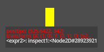
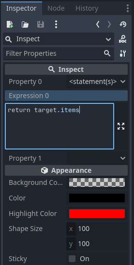

# Change Log

## i2w2_cp

### New Features

- **New Inspect Behavior:** Inspect the state of any Godot node from the running game (#23)
  - To inspect the state of a node, you can now select it in the scene tree and add an `Inspect` behavior to its children (<kbd>Ctrl</kbd> + <kbd>A</kbd>, <kbd>insp</kbd>, <kbd>Enter</kbd>). The resulting node will render the selected portion of the parent node's state in the scene. All properties are lively updated.
  - **Properties:** In the inspect behavior's inspector, you can select any properties from the node's class and its superclasses.
  - **Multiple properties:** You can also select multiple properties to inspect at once. Choose <kbd>\<remove></kbd> from the top of the dropdown to remove a property from the list again.
  - **Custom expressions:** You can also select <kbd>\<statement(s)></kbd> at the top to enter a custom code expression that is evaluated with access to the `target` node.
  - **Highlighted changes:** When the inspected properties change, the behavior will highlight the changed properties for a short time.
  - **Dynamic layout:** You can use the resize handles to change the size of the inspect behavior. The initial layout avoids overlapping with the parent node's and its children's visible shapes.
  - **Tooltips and truncation for long strings:** Value strings that are too long to fit into the selected layout are truncated. Hover over the truncated string to see the full value in a tooltip.
  - **Customizable appearance:** You can change the text and background colors of the behavior in the inspector.
  - **Known issues:**
    - Editing an expression while the game is open is tricky as the expression is evaluated as-you-type. This can lead to unhandlable runtime errors. To avoid this, prefix the expression with `#` until you are done editing it.
    - Custom expressions can only be displayed when the game is open.

- **Improved error handling for `eval`:** When a code expression anywhere in the system (e.g., in a connection or in an inspect behavior) contains a syntax error or cannot be saved, this error is now communicated clearer to the user in the output console. (You will no longer see the cryptic error message "invalid set index 'ref'".)

### API Changes

- Code evaluation/`ConnectionList`: Added `ConnectionList::eval_or_error() -> ExecResult` for handling syntax errors in code expressions gracefully. `ExecResult` offers an `error` property and a `value` property for accessing the result of the evaluation.

---

| `Inspect` behavior in scene | Properties of `Inspect` behavior |
| --- | --- |
|  |  |
