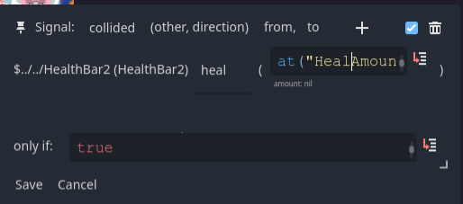

# Move planning game


We started this week by planning the basic game mechanics on a whiteboard. This way we also found some insights regarding UI design and abilities for the players.

## How we utilized pronto nodes

We used the Healthbar as actual healtch display for the players but also for displaying the number of moves a player has already planned (blue bar below the healthbar).

## Where we used code

We used code for the entire player logic. Pronto isn't good in providing a way to structure code with multiple functions, etc. which is what we used a lot here in order to have readable code.

Unfortunately, when we used Code Behaviors we sometimes had to still duplicate our code (for each player). This is where we wished for having global functions that we can write once in a central place and use at different locations.

## Problems

### Duplicating Code-Behavior

We had a lot of situations where we basically had to copy many nodes for player 2. However, when copying a code-behavior and then changing its code (from `player1` to `player2`) we changed both the original and the copied node because they somehow share the expression. This meant for us that we needed to create each node invidiually and basically had to just copy paste the content.

#### Duplicating in general

We observed that when duplicating any Pronto node with an expression (e.g. `Code`, `Bind`, ...) they always refer to the exact same expression, so changing one of them always changes all other copies (and originals). In some cases (rarely) this is desired, but we thinking that by default it should copy those expressions to allow individual editing.

### Key Nodes

For our inputs we have 6 keys per player, however we only want to trigger the same connection on each key press. Currently we had to create 6 key but we thought that one may want to have a node that accepts certain keys and offers the same triggers as the key note while also specifying which of the selected keys triggered.

### Issues with Healthbar

We had a problem with the HealthBar where it resets the current health to max on godot startup. We found the problem for this and want to fix it in the next week for master.

### Value

When changing the `min` or `max` of the value, the current value is not updated if it is outside these bounds.

### Connection Window

The text inputs for the parameters do not scale anymore. This means that for some input you cannot read it in the window which is annoying. Even moving the cursor further doesn't scroll the window. Resizing the window does nothing either.



## User study

We also conducted a user study this week. For simplicity we also noted down the basic commands and goal of the game to present to the users.

### Goal

You have to schedule a number of actions for your character to execute. Both players choose their moves simultaniously but without knowledge of the opponents move. Then both moves are executed secuentually at the same time. Your goal is to kill the enemy player with your attacks. The game can also end in a draw.

### Controls

There are 6 actions you can choose from:

* Moving one tile to one of four directions.
* `Cross-Attack` that hits the enemy if they are in the same row or column as you.
* `Box-Attack` that deals damage to enemies that are adjacent to you (on one of the `8` fields surrounding your field) and a litte damage to enemies that are a bit further away.

```
Cross-Attack:
....#...
....#...
....#...
####X###
....#...
....#...
....#...
....#...
```

```
Box-Attack:
........   
...ooo..
..o###o.
..o#X#o.
..o###o.
...ooo..
........
........
```

#### Player 1

You move with `WASD`. You can use the `Cross-Attack` with `Q` and the `Box-Attack` with `E`.

#### Player 2

You move with `IJKL`. You can use the `Cross-Attack` with `U` and the `Box-Attack` with `O`.

### Feedback, Learnings and Results

Even though our game concept might sound complicated in the beginning, after the first planned round of the game the players understood the concept of the game and developed their own tactics.

We found out that it is interesting to not only schedule the actions in a `FiFo`-matter (Queue) but also have some rounds where they are executed in the inverted order (`LiFo`, Stack). This made planning several moves ahead even more difficult because they need to be added in a different order.

When playing rounds with only the Stack Systems (inverted order) it caused a lot of "brainfuck" which was pretty fun to watch when the players realized that the moves they planned were in the wrong order (because even though every round was the same stack-system, they forgot).

It also got a bit borring to always plan just 3 moves ahead. This is why we randomized the number of moves to plan each round.


Since our game is completely fair we also had many games that ended in a draw. In most cases this was caused by a szenario where both players had low HP and the chance to either kill their opponent while dying themselves (if their opponent chose the same tactic) or to run away. However, in most cases they decided to kill their opponent which results in a draw.

As feedback they proposed to add items to the game in order to add randomness to it. This is why we decided to add some kind of randomness to our game in form of a **heal potion** that randomly drops on a tile, healing a player for a certain amount.

Other proposed features include:

* **Mines**: Similiar to health potions they spawn and deal damage when stepping on them (*Note: Added after first user-testing Session as Poison*).
* **Walls**: They can be placed on a tile to block `Cross-Attack` and movement. They can either have a lifetime or stay till the end of the game
* **Battle Royale Mode**: Make the playing area smaller after a few rounds by removing a few outermost tiles. This causes more "action" and shortens the duration of a game (average rounds took around 5 - 6 min because both players played defensive and went for the health item).
* **Limited Attacks**: Since one of the tacics included "spamming" attacks, one player supposed to limit the number of attacks that a player can schedule. Each round the player gets 1 or 2 attacks that are kept if not used, up to a limit of 5.

Overall we saw a lot of positive feedback and enthusiasm for our prototype of this week, which already looks a lot like a complete game. Our main feature that we wanted to prototype was the scheduling mechanic for planning multiple moves ahead which was recieved very well by all testers. Some people even said that they could imagine this game as a minigame playable in the browser with friends or as a "Discord-Activity" (those are minigames that are playable via the chatting-service "Discord" among all players that are simultaniously in a voice-call).

Unfortunately, the developers of this prototype (us) have discontinued their work on this ;).

## Improvements for next week

We also thought about more improvements for our features from last week and other things we would like to have implemented/added to Pronto:

* **Healthbar**: Fix issue where `current` is set to `max` on godot start.
* **Healthbar**: Use gradient instead of Array of colors.
* **Placeholder**: Merge with `PlaceholderShape`.
* **Placeholder**: Recoloring options for the used sprite.
* **Placeholder**: Add "Emoji-API" as a fast way of finding sprites.
* **Select-Behavior**: Think about adding a new behavior for drag-to-select (or mayber even drag-and-drop) options (like we used in our last weeks prototype).
* **Key**: Add option to show the key-node in the game with a label to describe the controls of the game.
* **Value**: Fix out of bounds when changinig `min` or `max`.
* **Code**: Remove Label from Code-Behavior and use the name from the object-tree instead
* **Function-Behavior**: A behavior that stores different functions that can be used anywhere (just like `at()`) in order to reduce duplicate code while still having a structure.
* **GLOBAL-Nodes**: Very often we have to traverse the tree in order to get to a specific node. It would be very nice if we could just give certain (Pronto)-nodes a global ID and access them via `at(...)` so we don't need to go through parents and children anymore.
* **Autocomplete for `at()`**: It would be nice if we could have an autocompletion/suggestion for the `at` method because sometimes you are just not 100 % certain, how you named a Value.
* **Prototyping UI**: Add option to start the UI closed.
