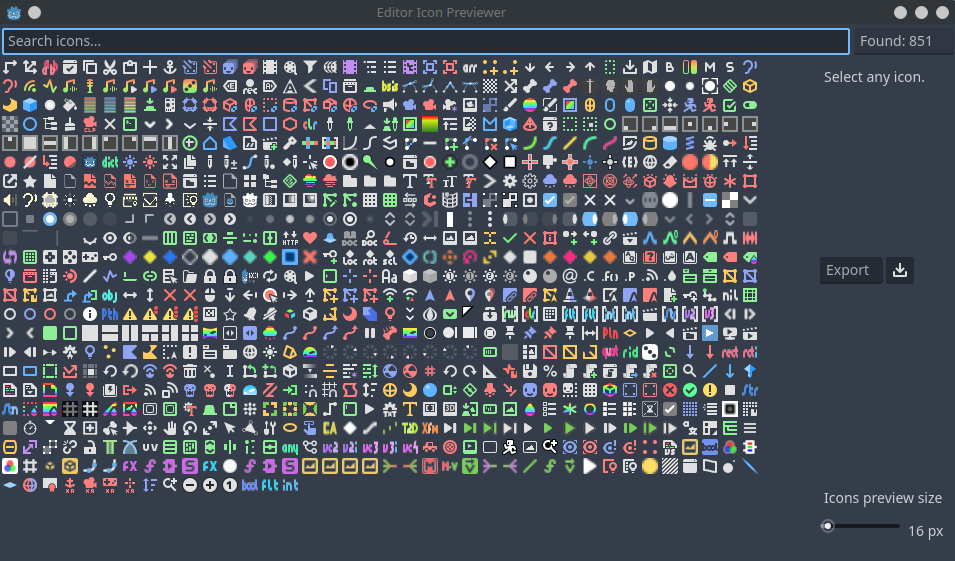
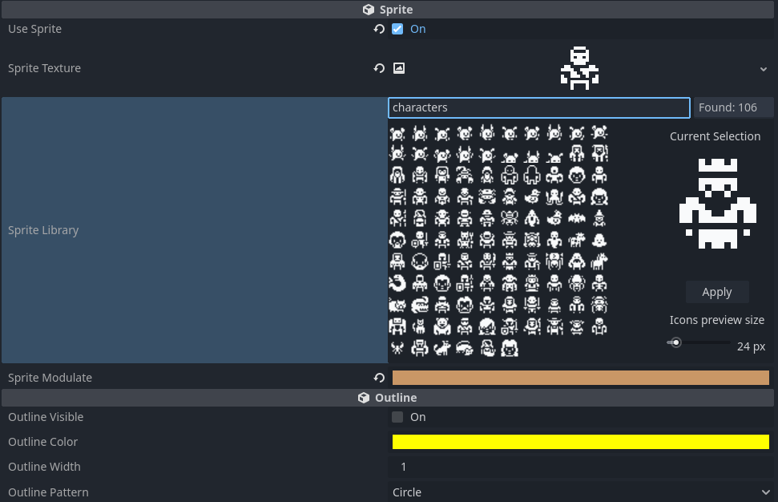

# Iteration 5 Week 2 - Julian & Finn

In this week we focused mainly on the Placeholder Behavior and its sprite functionality. We also fixed some issues with the HealthBar and Code Behavior.

## Code-Behavior

We removed the `label` from the Code-Behavior and use its scenename instead. We found ourself labeling nodes twice (once in the tree and then again in the label) so we decided to change this.

We also added comments to the Behavior for documentation.

## HealthBar-Behavior

We replaced the `progress_colors` array with a `progress_gradient` as suggested in the meeting.

We also fixed the problem described by Luc, where the current health would be set to 100 on game start even though max is higher. The problem occured because of the ordering of the variables inside the script: By placing current above max, when the game starts it tries to set current to a value (like 400) when max is still on its default value of 100, so current is clamped to 100. Then max gets set to its value of 400 but current is not updated anymore. This caused the issue of wrong health at game start which is now fixed by setting current health after max health.

Additionally we fixed the displaying of outgoing lines from the HealthBar and Placeholders (see [below](#general-behavior-fixes)).

As already mentioned in the Slack channel, the documentation comments for the inspector are broken for everything comming after the first exported category. However, this seems to be a godot problem that we cannot fix easily but we still want to mention it here before we forget about this.

## Placeholder-Behavior

### Sprite Library

We want to enable the user to quickly select and apply fitting sprite images to the Placeholder. For the textures we used the Kenney 1-Bit Pack ([https://kenney.nl/assets/1-bit-pack](https://kenney.nl/assets/1-bit-pack)) as suggested by Tom.

To allow for displaying different suggestions and a quick selection we want a visual representation of all textures ideally combined with an option for filtering.  We used the Editor-Icon Previewer Plugin as an inspiration and basis to start from, because it already has a nice visual representation and other features like a preview, scaling and a search bar.

Similar to the pronto expressions, we created a new `EditorInspectorPlugin` (this is a godot class and not a "plugin" like pronto!) for the `PlaceholderBehavior` for selecting and applying tiles from our tilemap as textures for the sprite.

The searchbar can be used for filtering the textures. Currently only the following categories are available:

- Characters
- Accessories
- Nature
- Cards

Those categories were created manually by us which makes it difficult to associate a name with every single icon since they are not provided by the tilemap.

### Modulate Color

We added a new color option to modulate the color of the sprite. This works well with the 1-Bit textures because they can be entirely colored with this. Nevertheless, this also works for every sprite that is selected.

## General Behavior Fixes

Fixed that Behaviors without a displayed icon still have outgoing lines drawn. We also implemented correct line drawing for rotated Behaviors.
