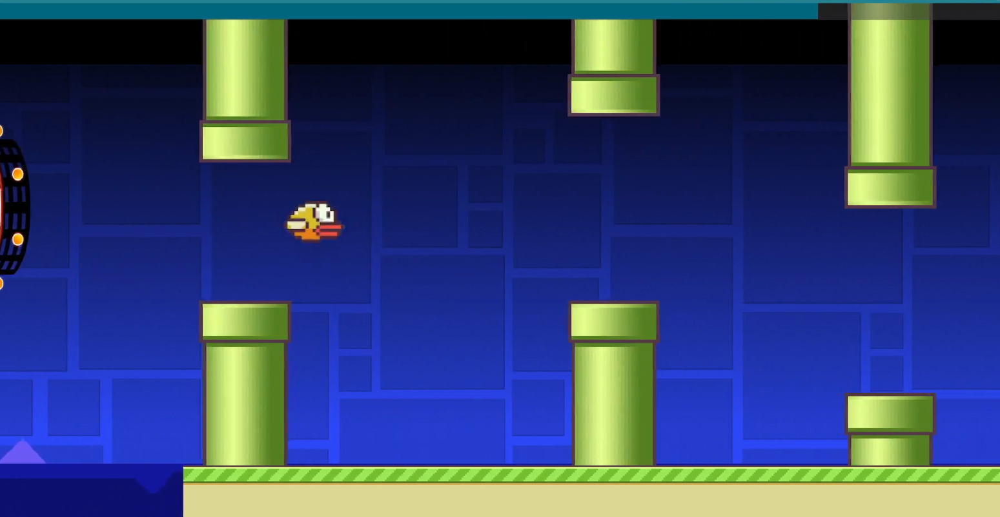

# Iteration 6 Week 1 - Geometry Dash

You can play our game on [itch.io](https://finnxyz.itch.io/geometry-dash).

We want to foucs on following functionality from the original game:

- Simple Cube: Press space to jump (casual mechanic)
- Gravity Effect: Gravity of the level is switched, player still jumps
- Gravity Change / Ball: Pressing space inverts gravity (the cube is a rolling ball in this section)
- "Ufo": player can jump in the air (like flappy bird)

A somewhat showcase of these can be found [here](https://www.youtube.com/watch?v=lvq9UTK0GPQ&t=288s).

In both our game and the original geometry dash, the introduction of a new mechanic happens whenever the player reaches a "portal". The color and shape of the portal are also indicating, what happens next (and we used the original corresponding textures in our game, in case you still remember them :D).

Within the default mode (cube) we also added following interactions:

- Jump-pad: When touched, the player is launched into the air.
- Mid Air jump: Yellow circle that allows the player to jump mid air when inside.

## Problems with Pronto

We had many components like the Yellow mid air jump or the jumppad that we wanted to have multiple times. However, duplicating them didn't work because the placeholders of the duplicate do not copy the texture that they have. This meant that we always had to instantiate the szene they were created in (yes, we created an extra szene for those, otherwise we would have to create them several times with all of their components). This szene always spawned in (0, 0) so we also had to move it ~15.000 pixels when working on later parts of the level.

## Where we had to use code

Surprinsingly we didn't have to create any non-pronto script and were able to create anything within godot-pronto.

However, we had to change certain behaviors like the PlatformController to work for our use-cases.

## User testing

### Dev playtest

For balancing the game, especially the jump-height and gravity, we did a lot of playing around with simple obstacles until we found good values that feel smooth. This was a real pain, because we wanted to be able to jump 2 blocks high, but then the gravity was too low. This is why we accepted, that the cube can only jump roughly 1.5 blocks high and 3-4 blocks wide (without spikes). In the original game you can jump above 3 high spikes that are in a row, in our case we only managed this if the first and last spikes are small ones and even then it was very difficult so we decided to not use this constellation in the game (We were just to frustrated by that jump).

While creating the video for our submission, my thoughts were the following (orderd by time of occurence):

- This music rocks
- Wow, I really like those jumps that fit to the music

- Careful with spacebar now (If you hold space just a bit too long you instantly swap gravity back and die, so you need to be really quick)
- This music kind of triggers (playing the game for 25 minutes)

- Yes, I am almost there, please dont die now (3 attempts for this part in total)

- FINALLY!!!! Took me long enough (29 minutes)

But those were my thoughts as the developer, wo built the level and knew, what comes next.

### Other testers

First, lets start this section of with some expressions:

- "Ist echt wie damals"
- "Coole music"
- "Das ist echt so wie das original"
- "Wo sind die Checkpoints?"
- "Huch, jetzt dreht sich die Schwerkraft um"
- "Kann ich bitte die Musik ausmachen?"
- "Es laggt zu sehr" (Grund: Mein Laptop ist nicht der beste, erst recht nicht bei 33 °C in der Sonne draußen)
- "Arggghh" (x50 und öfter)
- "Flappy Bird?! Lol"

Overall, many people failed in the first third of our level (in the first upside-down part or before) and didn't even make it to the rolling part (where Space switches gravity).

We also got the feedback that the player should disappear when he hits a wall (before, the player was still visible but didnt continue moving and then the game restartet), just like it is when he collides with a spike.

We also noticed during testing, that some jumps are just a little bit too difficult, so we decided to remove certain spikes/blocks.

Since we were ready for playertests very early this week, we were able to conduct a user test with many people at my weekly dance-party. Everyone wanted to try out the game but didn't manage to get that far due to the bad performance of my laptop used in the tests.

With the deployment of the game working on monday (you can find our game [here](https://finnxyz.itch.io/geometry-dash)), we managed to give everyone the opportunity to play the game at home with their own computer which was a way nicer experience.

We wish we had used this method in the past weeks as well as it would've made user testing so much easier. Deploying the game (when all requirements are met) only takes a minute now, so shipping out a new version can be done quickly.

## What we want to improve next week

- We should definitly fix copying/duplicating pronto nodes as this is really annoying when designing a level
- Fix issue with Placeholder, where the sprite does not get copied.
- Fix issue with Placeholder, where `use_sprite` of the copy is set to true, even though the original has it false (and doesn't even have a sprite).
- If possible: Instantiating a scene or pasting a copied object should spawn at the position of the cursor in the scene and not the origing (or wherever they currently spawn).
- Improve documentation on how to export a game and upload it to [itch.io](https://itch.io)
- Fix export of game with `at()` which currently doesn't seem to work properly as mentioned in Slack
