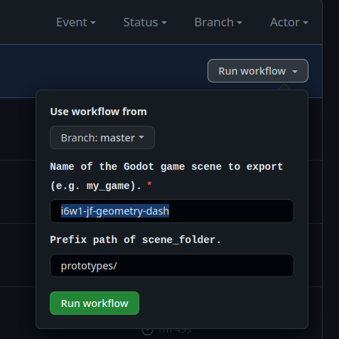

# Iteration 6 Week 2

## HealthBar

Add invulnerability to HealthBar with an additional option to enable/disable healing when invulnerable. The user can also specify a color for the border that is displayed around the HealthBar when the HealthBar is invulnerable.


## Deployment to Github Pages

We wanted to create an easy way of uploading your game to the web.

To achieve this, we have created a github workflow based on [https://hub.docker.com/r/barichello/godot-ci/](https://hub.docker.com/r/barichello/godot-ci/) for exporting godot/pronto prototypes and deploying them to Github Pages.

To start the workflow you first have to run a new workflow after pushing your game to a branch. After that a new window appears where you first need to select the branch. You also need to provide the name of your game (the name of the folder containing your scenes and **all game assets!**). If the parent directory deviates from `prototypes` the prefix path can be adapted.



If you want Github Pages to show more information about your game you can place a `game_info.json` file into your game folder ([Documentation](https://github.com/hpi-swa-lab/godot-pronto/blob/gh-pages/README.md)):
```[json]
{
  "title": "My Game",
  "description": "The description of my game that is displayed in the overview.",
  "authors": ["Developer 1", "Developer 2"],
  "thumbnailType": "png"
}
```

The workflow will no run a godot docker container. Using the script `scripts/export.sh` an export config `export_presets.cfg` is created containing all pronto files and your game. After the godot export terminates the `build/web` folder containing the export is committed to the [gh-pages](https://github.com/hpi-swa-lab/godot-pronto/tree/gh-pages) branch under a subfolder with your game name.

You can now open [https://hpi-swa-lab.github.io/godot-pronto/](https://hpi-swa-lab.github.io/godot-pronto/). Your game should be displayed with some basic information as well as a play button for starting the game.

### Pitfalls/Issues

When I created the `export.sh` the workflow was unable to execute it. This was caused by Windows, because it doesn't set the correct permissions. Luckily I found this: [GitHub Actions: Fixing the 'Permission Denied' error for shell scripts](https://dev.to/aileenr/github-actions-fixing-the-permission-denied-error-for-shell-scripts-4gbl).

The command `git update-index --chmod=+x export.sh` has to be executed locally in order to allow the script to be executed in the workflow.
