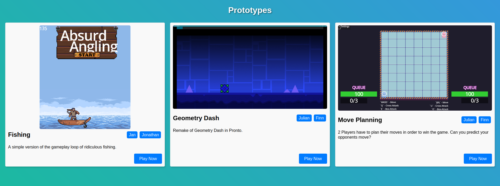

# Iteration 6 Week 2

## HealthBar

Add invulnerability to HealthBar with an additional option to enable/disable healing when invulnerable. The user can also specify a color for the border that is displayed around the HealthBar when the HealthBar is invulnerable.


## Deployment to Github Pages

We wanted to create an easy way of deploying the created games and prototypes.

To achieve this, we have created a github workflow based on [https://hub.docker.com/r/barichello/godot-ci/](https://hub.docker.com/r/barichello/godot-ci/) for exporting godot/pronto prototypes and deploying them to Github Pages.

You can find a detailed instruction on how to deploy a game [here](#contribution-to-readme) or [online](https://github.com/hpi-swa-lab/godot-pronto#phase-3-deploying-your-prototypegame).


If you want Github Pages to show more information about your game you can place a `game_info.json` file into your game folder ([Documentation](https://github.com/hpi-swa-lab/godot-pronto/blob/gh-pages/README.md)):

```json
{
  "title": "My Game",
  "description": "The description of my game that is displayed in the overview.",
  "authors": ["Developer 1", "Developer 2"],
  "thumbnailType": "png"
}
```

The workflow will no run a godot docker container. Using the script `scripts/export.sh` an export config `export_presets.cfg` is created containing all pronto files and your game. After the godot export terminates the `build/web` folder containing the export is committed to the [gh-pages](https://github.com/hpi-swa-lab/godot-pronto/tree/gh-pages) branch under a subfolder with your game name.

You can now open [https://hpi-swa-lab.github.io/godot-pronto/](https://hpi-swa-lab.github.io/godot-pronto/). Your game should be displayed with some basic information as well as a play button for starting the game.



### Github Pages vs ITCH.IO

We first tried to directly deploy to [itch.io](https://itch.io). This can be achieved by using [butler](https://itch.io/docs/butler/) in our workflow. The problem we encountered is that `butler` is only able to upload game files to existing projects and is not able to create new projects itself. Because each itch project can only hold one game, it requires the manual process of first creating the project manually if you don't want each game export to overwrite the previous. Also the `SharedArrayBuffer` option needs to be set manually. One other point is that `itch.io` only supports 20 projects for the normal free tier.

With Github Pages we can deploy completely automated (once you have entered the inputs like `project_folder`). We have an `index.html` file which automatically looks for all games deployed and displays them accordingly. With this solution we are not bound to any restrictions like the number of games. We also have full control over how we display the individual games. For instance a title, description, list of authors and thumbnail can be provided.

### Pitfalls/Issues

When I created the `export.sh` the workflow was unable to execute it. This was caused by Windows, because it doesn't set the correct permissions. Luckily I found this: [GitHub Actions: Fixing the 'Permission Denied' error for shell scripts](https://dev.to/aileenr/github-actions-fixing-the-permission-denied-error-for-shell-scripts-4gbl).

The command `git update-index --chmod=+x export.sh` has to be executed locally in order to allow the script to be executed in the workflow.

## Contribution to README

To deploy your game to [hpi-swa-lab.github.io/godot-pronto/](https://hpi-swa-lab.github.io/godot-pronto/) you can use the [Build & Deploy Game](https://github.com/hpi-swa-lab/godot-pronto/actions/workflows/build-deploy.yml) Action.

### Preparation

Before you can deploy your game check the following:

1. Make your game the main scene of the godot project.
2. Make sure that all assets you use are inside your projects folder (e.g. `prototypes/myPrototype`).
3. Make sure that no filenames or folders have a `space` character in them.

#### game_info.json and thumbnail

In order to display detailed information of your game make sure to create a `game_info.json` file inside your projects folder. Your file could look like this:

```json
{
  "title": "My Game",
  "description": "The description of my game that is displayed in the overview.",
  "authors": ["Developer 1", "Developer 2"],
  "thumbnailType": "png"
}
```

Also make sure to have a thumbnail in your folder that matches the `thumbnailType` you provide (currently supported are `png` and `jpg`).

For more details on the supported structure checkout the [documentation of gh-pages](https://github.com/hpi-swa-lab/godot-pronto/tree/gh-pages#readme).

### Workflow

You have to run the [Build & Deploy Game](https://github.com/hpi-swa-lab/godot-pronto/actions/workflows/build-deploy.yml) Action manually. As the branch to "use the workflow from" you select your branch that you developed on and that you prepared in the step above.

In the next line you have to provide the name of the folder that your project is in (e.g. `myPrototype`). In the second line you can specify another path to this folder in case you didn't create your project inside the `prototypes` folder.

Check if the workflow runs with any issues. If everything went well it should push your game to the `gh-pages` branch. This automatically triggers another workflow to rebuild the page. Wait until this workflow has completed before going to the next step.

### Testing

After the workflow executed you can head over to [hpi-swa-lab.github.io/godot-pronto/](https://hpi-swa-lab.github.io/godot-pronto/). You should see your game appear in the list of games. Click on the "Play Now" button and check if everything is working.

### Troubleshooting

If you accidently trigger the workflow with an incorrect folder name it may execute without generating any errors but will create a new game in the [gh-pages branch](https://github.com/hpi-swa-lab/godot-pronto/tree/gh-pages). This will automatically be rendered into the list of games. In order to delete it, you have to manually remove it from the gh-pages branch. Please be carefull when doing so and do not delete any other files other than the projects folder you want to delete.
